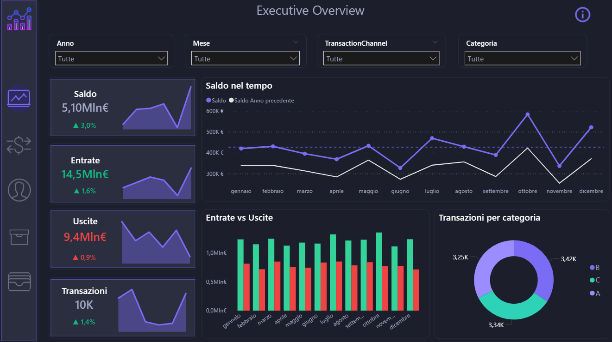
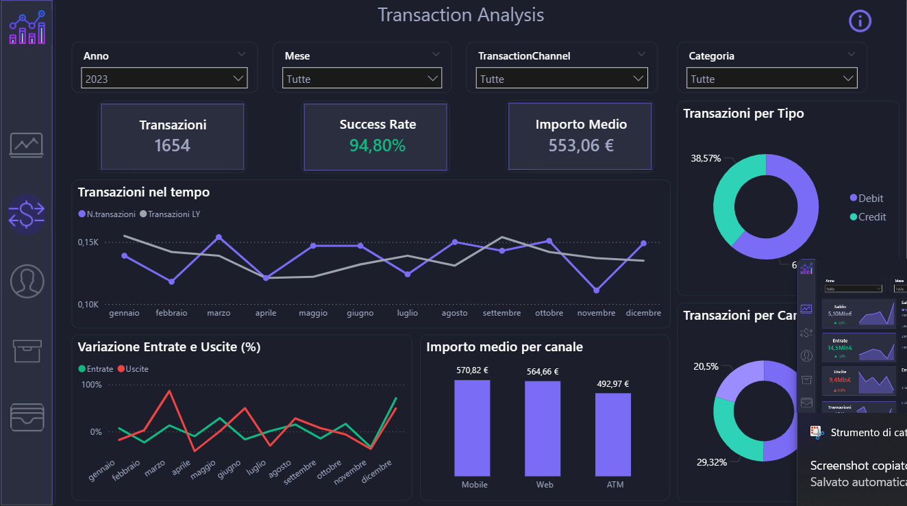
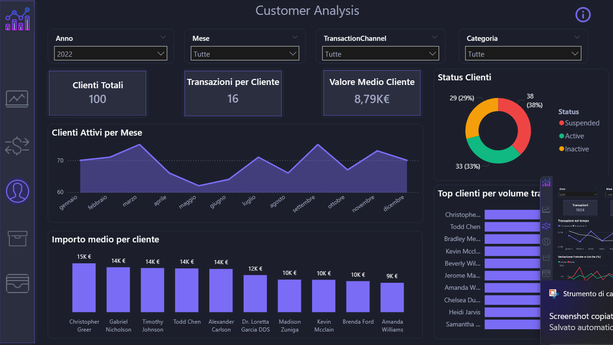
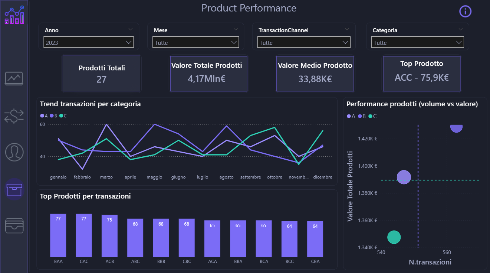
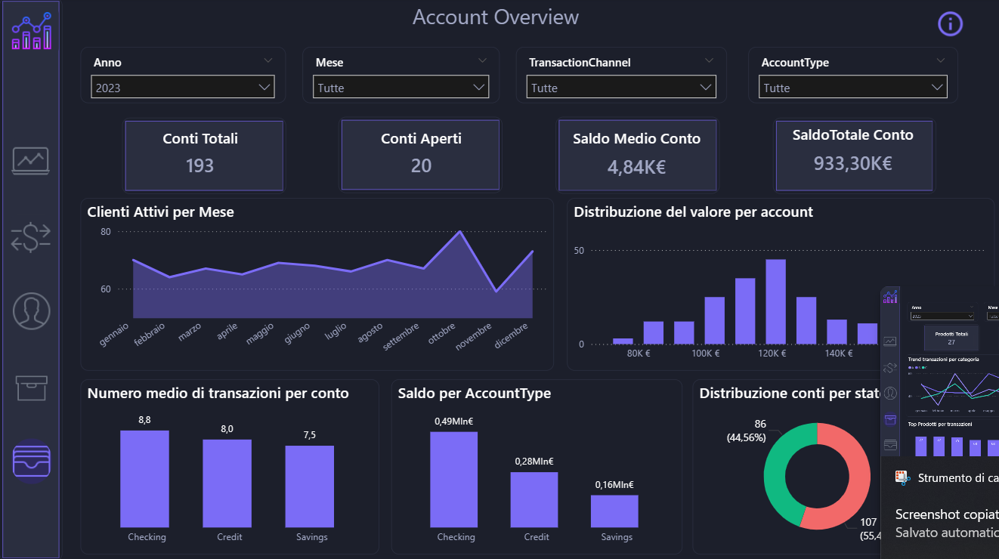

# Financial Transactions Business Intelligence Dashboard

Interactive **Business Intelligence dashboard** built with Power BI to analyze financial transactions, customer behavior, product performance and account activity.

The dashboard transforms raw transactional data into clear insights that support data-driven decision making.

---

# Tools Used

Power BI  
Data Modeling  
DAX  
Data Visualization  

---

# Dashboard Structure

## Executive Overview

Provides a high-level view of overall financial performance including balance, income, expenses and transaction activity.

---

## Transaction Analysis

Detailed analysis of transaction performance and trends.

---

## Customer Analysis

Focuses on customer engagement and transaction behavior.

---

## Product Performance

Analyzes product level performance and transaction trends.

---

## Account Overview

Provides insights into account activity and distribution.

---

# Key Insights

- Monitoring financial performance trends through balance, income and expense metrics  
- Identifying customer transaction patterns and high-value clients  
- Evaluating product performance based on value and transaction volume  
- Understanding account distribution and activity levels  

---

# Author

Edoardo Morgillo  
Data Analyst  

LinkedIn  
https://www.linkedin.com/in/edoardo-morgillo
